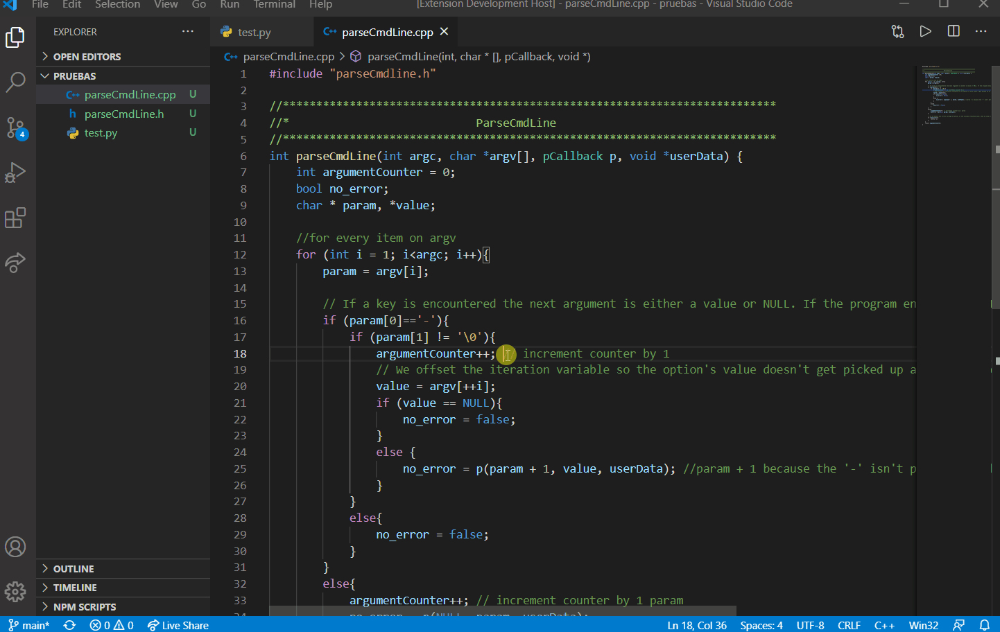

<h1 align="center">
   
  
 
  Comments Out
   
</h1>

   • <a href="#what-is-it">What it is</a>
   • <a href="#features">Features</a>
   • <a href="#languajes-support">Languajes support</a>
   • <a href="#requirements-to-run">Requirements to run</a>
   • <a href="#todo">Todo</a>
   • <a href="#known-issues">Known Issues</a>
   • <a href="#release-notes">Release Notes</a>

## What it is

This repo has the code of the visual studio code extension Comments Out, this is an extension that allows you to clear all the comments in your code.

## Features

At the moment the main feature is the possibility of deleting all the comments of the code in any of the languages allowed.

To do that in the file that you want to change need to open the Command Palette (ctrol + shift + p (windows)) and then select "Comments Out".

 

 

## Languajes support

- C
- C++
- C#
- JavaScript
- Java
- Perl
- PHP
- Python
- R
- Ruby

## Requirements to run

You can run the program by cloning this repository and using the debugging function in Visual Studio code to verify the operation of this extension.

Once you run the extension with the debugging window, there appear a window where you will be able to use the extension.

## TODO

- Multilines comments

## Known Issues

- Nothing at the moment

## Release Notes

Users appreciate release notes as you update your extension.

### 1.0.0

- Initial release of Comments Out

### 1.0.1

- Different languages support added 
- Fix some unespected problems

